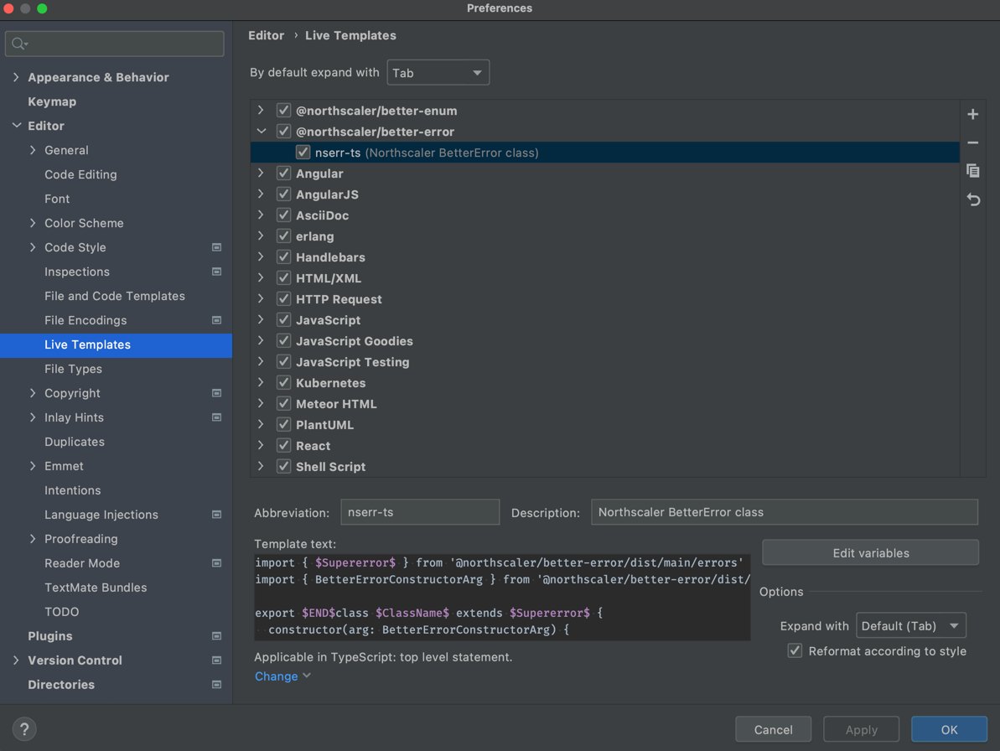
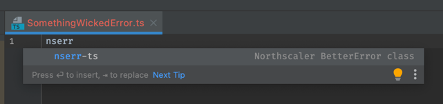
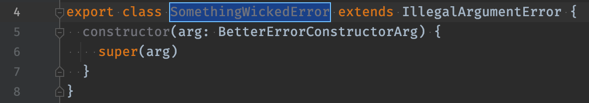

# JetBrains Live Templates

This directory contains [JetBrains live templates](https://www.jetbrains.com/help/idea/using-live-templates.html) that
are specifically designed to work with this package.

## Installation

There are two ways to install these templates:

1. Copy the files into your JetBrains `templates` directory.
1. Symlink from your JetBrains `templates` directory to this file.

### Copying to JetBrains `templates` directory

Copy the XML files located in this directory to
your [JetBrains IDE configuration directory](https://www.jetbrains.com/help/idea/tuning-the-ide.html#config-directory).

> NOTE: If you upgrade to a newer major or minor version of your IDE, your template settings directory will be copied to the new IDE's settings directory if you so chose that option during installation.

For example, for WebStorm 2021.1 on macOS Big Sur:

```shell
cp *.xml ~/Library/Application Support/JetBrains/WebStorm2021.1/jba_config/templates
```

There may be slight differences on your machine depending on OS, JetBrains product & versions thereof.

### Symlinking into your JetBrains `templates` directory

Linking the template has the advantage that you can easily get updates by cloning this directory and easily getting
updates by pulling.

> NOTE: If you upgrade to a new minor or major version of your IDE, you may need to see if your symlinks were carried over to the new templates settings directory.

For example, for WebStorm 2020.1 on macOS Big Sur:

```shell
# in this directory of your local git clone of this repo
for f in $(ls *.xml); do \
  ln -s $PWD/$f ~/Library/Application\ Support/JetBrains/WebStorm2021.1/jba_config/templates/$f; \
done 
```

## Usage

In your IDE, navigate to `Preferences`, `Editor`, `Live Templates`. There, you'll see the `@northscaler` template group
named after this package.



Note the abbreviations provided for each of the templates and use them in your editor:



After selecting the live template, use the tab key to move through the variables, modifying them as desired:


